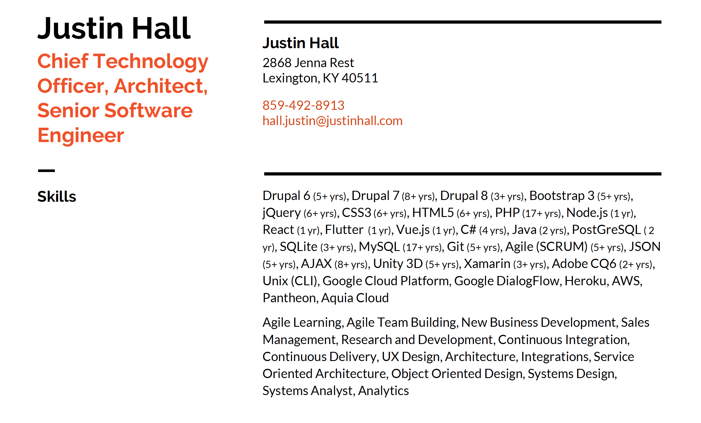

# About
## Justin Hall

Creative Developer, Tech Enthusiast, Digital Artist, Agile Coach.
{:.lead}

The reason for a *blog* is to break away from social media's echo chambers.  I want my content to make an impact for me.  This blog will enable both expression and interaction that can't be achieved by and large within only one or two social media platforms.  I am on many social media platforms, but yet none do a better job of binding them all together than a website.  

This site is also a *portfolio* to showcase the projects I wish to share and promote.  This site is powered by [Jekyll] and hosted at [GitHub].  The theme includes a *resume* template.   Feel free to grab the [PDF](assets/Resume.pdf), but note it is a dynamic entity and will evolve.

Want a site like this for yourself? [Contact me](/contact).

> [blog], a [portfolio], and a [resume].
{:.lead}

### Why a Blog
I want to **blog** more on a platform of my choosing that meets the needs that I have.  The solution is to create an environment and utilize a technology that is malleable.  Not every blog post should be alike and not every blog post should not be so unique that it costs a lot to produce.  My intention is to use this site to communicate my efforts and expressions more freely.

### Why a Portfolio
My **portfolio** continues to grow.  Up to now it has primarily grown undocumented.  It also has been poorly utilized.  I plan to use it to communicate my passion and document all of the efforts I've been involved with over the past 18 years of working as a creative in tech.

### A Printable Resume
Get this **resume** while it's hot! [PDF](assets/Resume.pdf).
How can I serve you?

{: data-width="1867" data-height="1389"}
A print resume.
{:.figure}

### A Personal Site That Belongs to You
**Hydejack** is 100% built on Open Source software, and is Open Source itself.  [Contact me](/contact) if you want a site similar to mine to promote your efforts.

[blog]: /blog/
[portfolio]: /projects/
[resume]: /assets/Resume.pdf/
[Hydejack]: https://hydejack.com/
[Jekyll]: https://www.jekyll.org/
[GitHub]: https://www.github.com/

*[FLIP]: First-Last-Invert-Play. A coding technique to achieve performant page transition animations.
